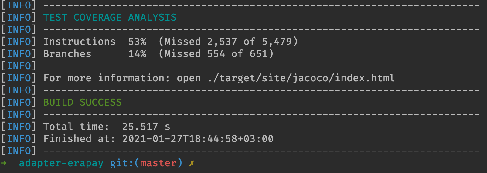

# test-coverage-analysis-script

Groovy script to print test coverage analysis results from jacoco report to the console.

## Intended use:

Add `jacoco-maven-plugin` and `groovy-maven-plugin` to your pom file:

```xml
<plugins>
    <plugin>
        <groupId>org.jacoco</groupId>
        <artifactId>jacoco-maven-plugin</artifactId>
        <version>0.8.5</version>
        <executions>
            <execution>
                <id>prepare-agent</id>
                <goals>
                    <goal>prepare-agent</goal>
                </goals>
            </execution>
            <execution>
                <id>report</id>
                <phase>test</phase>
                <goals>
                    <goal>report</goal>
                </goals>
            </execution>
        </executions>
    </plugin>

    <plugin>
        <groupId>org.codehaus.gmaven</groupId>
        <artifactId>groovy-maven-plugin</artifactId>
        <version>2.1.1</version>
        <executions>
            <execution>
                <phase>test</phase>
                <goals>
                    <goal>execute</goal>
                </goals>
                <configuration>
                    <source>
                        https://raw.githubusercontent.com/rbkmoney/test-coverage-analysis-script/master/script/TestCoverageAnalysis.groovy
                    </source>
                </configuration>
            </execution>
        </executions>
    </plugin>
</plugins>
```

Enjoy:

